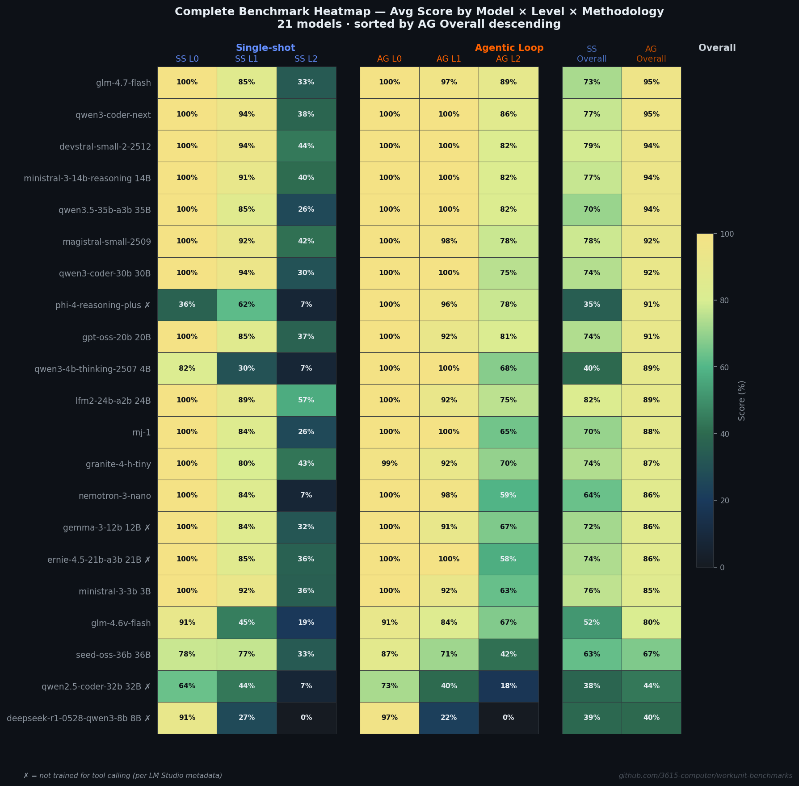
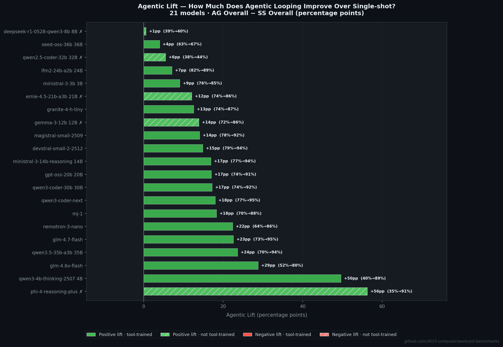

<!-- Target: r/LocalLLaMA -->
<!-- Tone: First-person, conversational, VRAM-focused -->
<!-- Graphs: graph1 (hero), graph5 (heatmap), graph4 (agentic lift) -->

# I benchmarked 21 local LLMs on real MCP tool calling — a 4B model hit 89% and beat most 30B+ models


*Single-shot (orange) vs agentic (blue) overall scores. Every model improved with agentic eval — some dramatically.*

---

**TL;DR**:

- **Small models punch way above their weight.** qwen3-4b-thinking-2507 (4B, ~3GB VRAM) scored 89.3% agentic, beating models 5-10x its size. ministral-3-3b (3B) hit 85.1%.
- **Single-shot evals lie.** Agentic evaluation (model gets real API responses back) scores +18pp higher on average, +37pp on multi-step tasks. If you're evaluating models for agent use, single-shot benchmarks are misleading.
- **Reasoning > tool training.** phi-4-reasoning-plus (14B, not tool-trained) hit 91.4% agentic — beating most tool-trained models. But it scored 35% single-shot. Raw reasoning ability + feedback loop = tool competence.
- **Winner: glm-4.7-flash** (30B) at 95.4% agentic overall. Close second: qwen3-coder-next (80B) at 95.2%.

---

## What I built and why

I spent the past weeks building a tool-calling benchmark for local LLMs against a real MCP (Model Context Protocol) API — not synthetic evals. Every tool call hits a real project management API ([Workunit](https://workunit.app)) with 19 tools that create, read, and modify real entities in a database. If a model creates a project, it gets back a real UUID that it needs to use in the next call.

Two evaluation modes:

- **Single-shot**: One prompt, one response, no feedback. Score whatever the model emits.
- **Agentic loop**: Model calls a tool, gets the real API response back, can keep going until it passes or hits a 300s timeout (25-turn cap).

Three difficulty levels across 28 tasks:

- **L0 (Explicit)**: "Call `create_project` with name=X, status=Y" — just format the call correctly
- **L1 (Natural language)**: "I need to track work on fixing our login page..." — figure out which tool and what params
- **L2 (Multi-step reasoning)**: "Set up everything for a dark mode feature" — plan the tool sequence, chain entity IDs, generate appropriate content

---

## Hardware

All inference ran locally. No cloud APIs.

| Component | Spec |
|-----------|------|
| GPU | RTX 4080 SUPER 16GB |
| CPU | Ryzen 7 7800X3D |
| RAM | 64 GB |
| Runtime | LM Studio 0.4.4 / llama.cpp CUDA 12 |
| Quantization | Q4_K_M (all models) |
| Context | 8192 tokens |
| Temperature | 0.0 |

---

## Models tested

21 models, 3B to 80B. 16 tool-trained, 5 control group (not fine-tuned for tools — marked with *).

| # | Model | Params | Tool-trained |
|---|-------|--------|:---:|
| 1 | mistralai/ministral-3-3b | 3B | Yes |
| 2 | qwen/qwen3-4b-thinking-2507 | 4B | Yes |
| 3 | ibm/granite-4-h-tiny | 8B | Yes |
| 4 | deepseek/deepseek-r1-0528-qwen3-8b* | 8B | No |
| 5 | essentialai/rnj-1 | 8B | Yes |
| 6 | zai-org/glm-4.6v-flash | 9B | Yes |
| 7 | google/gemma-3-12b* | 12B | No |
| 8 | microsoft/phi-4-reasoning-plus* | 14B | No |
| 9 | mistralai/ministral-3-14b-reasoning | 14B | Yes |
| 10 | openai/gpt-oss-20b | 20B | Yes |
| 11 | baidu/ernie-4.5-21b-a3b* | 21B | No |
| 12 | mistralai/magistral-small-2509 | 24B | Yes |
| 13 | mistralai/devstral-small-2-2512 | 24B | Yes |
| 14 | liquid/lfm2-24b-a2b | 24B | Yes |
| 15 | zai-org/glm-4.7-flash | 30B | Yes |
| 16 | qwen/qwen3-coder-30b | 30B | Yes |
| 17 | nvidia/nemotron-3-nano | 30B | Yes |
| 18 | qwen/qwen2.5-coder-32b* | 32B | No |
| 19 | qwen/qwen3.5-35b-a3b | 35B | Yes |
| 20 | bytedance/seed-oss-36b | 36B | Yes |
| 21 | qwen/qwen3-coder-next | 80B | Yes |

The control group models test whether general reasoning alone enables tool calling, without tool-specific fine-tuning.

---

## Results



*Per-level and overall scores for all 21 models in agentic mode. Color intensity = score.*

| Rank | Model | Params | Tool | L0 | L1 | L2 | Overall |
|------|-------|--------|:----:|-----:|-----:|-----:|--------:|
| 1 | glm-4.7-flash | 30B | Yes | 100.0 | 97.0 | 89.3 | **95.4** |
| 2 | qwen3-coder-next | 80B | Yes | 100.0 | 100.0 | 85.7 | **95.2** |
| 3 | devstral-small-2-2512 | 24B | Yes | 100.0 | 100.0 | 82.1 | **94.0** |
| 3 | ministral-3-14b-reasoning | 14B | Yes | 100.0 | 100.0 | 82.1 | **94.0** |
| 3 | qwen3.5-35b-a3b | 35B | Yes | 100.0 | 100.0 | 82.1 | **94.0** |
| 6 | magistral-small-2509 | 24B | Yes | 100.0 | 98.5 | 77.6 | **92.0** |
| 7 | qwen3-coder-30b | 30B | Yes | 100.0 | 100.0 | 75.0 | **91.7** |
| 8 | phi-4-reasoning-plus | 14B | No | 100.0 | 96.5 | 77.6 | **91.4** |
| 9 | gpt-oss-20b | 20B | Yes | 100.0 | 92.0 | 81.2 | **91.1** |
| 10 | qwen3-4b-thinking-2507 | 4B | Yes | 100.0 | 100.0 | 67.9 | **89.3** |
| 11 | lfm2-24b-a2b | 24B | Yes | 100.0 | 92.0 | 75.4 | **89.1** |
| 12 | essentialai/rnj-1 | 8B | Yes | 100.0 | 100.0 | 64.8 | **88.3** |
| 13 | granite-4-h-tiny | 8B | Yes | 98.6 | 91.5 | 69.9 | **86.7** |
| 14 | nemotron-3-nano | 30B | Yes | 100.0 | 98.5 | 59.3 | **85.9** |
| 14 | gemma-3-12b | 12B | No | 100.0 | 91.0 | 66.7 | **85.9** |
| 14 | ernie-4.5-21b-a3b | 21B | No | 100.0 | 100.0 | 57.6 | **85.9** |
| 17 | ministral-3-3b | 3B | Yes | 100.0 | 92.0 | 63.2 | **85.1** |
| 18 | glm-4.6v-flash | 9B | Yes | 90.9 | 83.5 | 67.1 | **80.5** |
| 19 | seed-oss-36b | 36B | Yes | 86.8 | 71.3 | 41.7 | **66.6** |
| 20 | qwen2.5-coder-32b | 32B | No | 72.7 | 40.0 | 17.9 | **43.5** |
| 21 | deepseek-r1-0528-qwen3-8b | 8B | No | 97.3 | 22.0 | 0.0 | **39.8** |

Key observations:

- **L0 is a solved problem.** 16/21 models scored 100%. If a model can't do explicit tool calls, something is broken with the template, not the model.
- **L2 is where models separate.** Scores range from 0% to 89.3%. This is the real test — multi-step planning, ID chaining, semantic content generation.
- **17 of 21 models exceed 85% overall** in agentic mode. For basic-to-moderate tool calling, most current local models work.
- **The bottom 4 have specific explanations** — code completion model (qwen2.5-coder), reasoning-only distill (deepseek-r1), template bugs (seed-oss-36b), or 9B with quirky formatting (glm-4.6v-flash).

---

## Single-shot vs agentic: the gap is massive



*How much each model improved going from single-shot to agentic evaluation.*

The average lift is +18pp across all models. But the interesting stories are at the extremes:

**phi-4-reasoning-plus: +56pp.** Went from 35.1% single-shot to 91.4% agentic. In single-shot it scored 36% on L0 (explicit instructions!) — it couldn't even format basic tool calls without feedback. But give it the agentic loop and it hits 100% on L0, 96.5% on L1, 77.6% on L2. This model has the reasoning ability — it just needs the feedback loop to get the format right.

**qwen3-4b-thinking-2507: +50pp.** From 39.7% to 89.3%. Same story — strong reasoning model that needs the agentic loop to show its capabilities. At 4B parameters this is remarkable.

**deepseek-r1-0528-qwen3-8b: +0.6pp.** The agentic loop doesn't help when the model fundamentally can't reason about tools. It scored 97.3% on L0 (can format calls correctly), 22% on L1, and 0% on L2. The problem isn't formatting — it's that the model can't map natural language to tools or plan multi-step chains. Feedback doesn't fix that.

The per-level lift tells the real story: **+5pp at L0, +13pp at L1, +37pp at L2**. Single-shot L2 pass rate is 2.0%. In agentic mode it's 49.7%. Multi-step tool chains basically require iterative execution with real feedback.

---

## Gotchas and surprises

**The Jinja disaster.** seed-oss-36b initially scored 0% on ALL agentic tasks. Not because the model was bad — because LM Studio's Jinja engine doesn't support Python's `in` operator for tuple/array membership testing. Three constructs in the chat template were incompatible. After rewriting them to use explicit equality checks, it scored 66.6%. Your model might be fine — the inference stack might be the problem.

**Code models != tool models.** qwen2.5-coder-32b is a 32B model that scored 43.5%. It's a code completion model that emits FIM tokens (`<|fim_suffix|>`, `<|fim_middle|>`). Code pretraining does not transfer to structured tool calling. Being good at code != being good at tools.

**Tool training gives consistency, not ceiling.** Tool-trained models averaged 88.7% with a standard deviation of 8.1pp. Control group averaged 69.3% with SD of 22.8pp. Tool training raises the floor and tightens the spread — but the best untrained model (phi-4, 91.4%) beats most trained ones.

**deepseek-r1 is a cliff.** 97.3% L0 (formatting is fine), 22% L1 (can barely pick the right tool from context), 0% L2 (zero multi-step reasoning). Not a gradual degradation — a cliff. The model's reasoning training doesn't generalize to tool-calling chains at all.

---

## What this means for your VRAM budget

Based on Q4_K_M quantization (what I tested). VRAM estimates are approximate for the model weights alone; actual usage depends on context length and batch size.

**Under 4GB** — ministral-3-3b (3B, 85.1%) or qwen3-4b-thinking-2507 (4B, 89.3%). The 4B model is the better pick if your agent framework supports agentic loops. If you need single-shot reliability, go with the 3B (76.0% SS vs 39.7% SS for the 4B).

**6-8GB** — granite-4-h-tiny (8B, 86.7%) or essentialai/rnj-1 (8B, 88.3%). Both solid. rnj-1 has higher L1 scores (100% vs 91.5%).

**8-10GB** — ministral-3-14b-reasoning (14B, 94.0%) is the sweet spot. Tied for 3rd place overall. 100% on L0 and L1. Or phi-4-reasoning-plus (14B, 91.4%) if you specifically want a non-tool-trained model.

**12-16GB** — devstral-small-2-2512 (24B, 94.0%), magistral-small-2509 (24B, 92.0%), or lfm2-24b-a2b (24B, 89.1%). Multiple strong options. devstral and magistral are both Mistral models with different strengths (devstral is more balanced, magistral has higher L2).

**16-24GB** — glm-4.7-flash (30B, 95.4%) is the overall winner and fits here. qwen3-coder-30b (30B, 91.7%) is also strong. qwen3.5-35b-a3b (35B, 94.0%) if you have the headroom.

**48GB+** — qwen3-coder-next (80B, 95.2%). Only 0.2pp behind the winner. If you have the hardware, it's consistently excellent (100% L0, 100% L1, 85.7% L2).

---

## Full data and reproducibility

Everything is open. Full source code, task definitions, runner scripts, all result JSONs with complete audit trails (exact prompts sent, every tool call with arguments, every API response received, scoring details):

**Repository**: [github.com/3615-computer/workunit-benchmarks](https://github.com/3615-computer/workunit-benchmarks)

The full research paper with formal methodology, all tables, and appendices is at `reports/research_paper.md` in the repo.

```bash
# Reproduce the full benchmark
cd local-llm-mcp-calling
LMSTUDIO_HOST=<ip>:1234 ./scripts/run_all_benchmarks.sh <access_token> <refresh_token>
```

Requires: Python 3.10+, LM Studio with CUDA, a Workunit API account (free tier).

---

## Questions for the community

1. **What models should I add next?** I'm particularly interested in testing new releases as they come out. The harness makes it straightforward to add models.
2. **Has anyone tried MCP tool calling with different quantizations?** All my results are Q4_K_M. I'd be curious whether Q5/Q6/Q8 changes the picture, especially for the models that struggled.
3. **Different MCP domains?** This is all project management tools. Would be interesting to see if the rankings hold for code execution, web browsing, or data analysis tool sets.
4. **Anyone comparing local models against cloud APIs on tool calling?** I only tested local models, but it would be useful context to know where these sit relative to GPT-4o, Claude, etc.

Caveats: single hardware config, single quantization level, single MCP domain, temperature 0.0, single run per model. The research paper has the full limitations section. Take the exact numbers with appropriate grain of salt — the relative rankings and findings should be robust.
