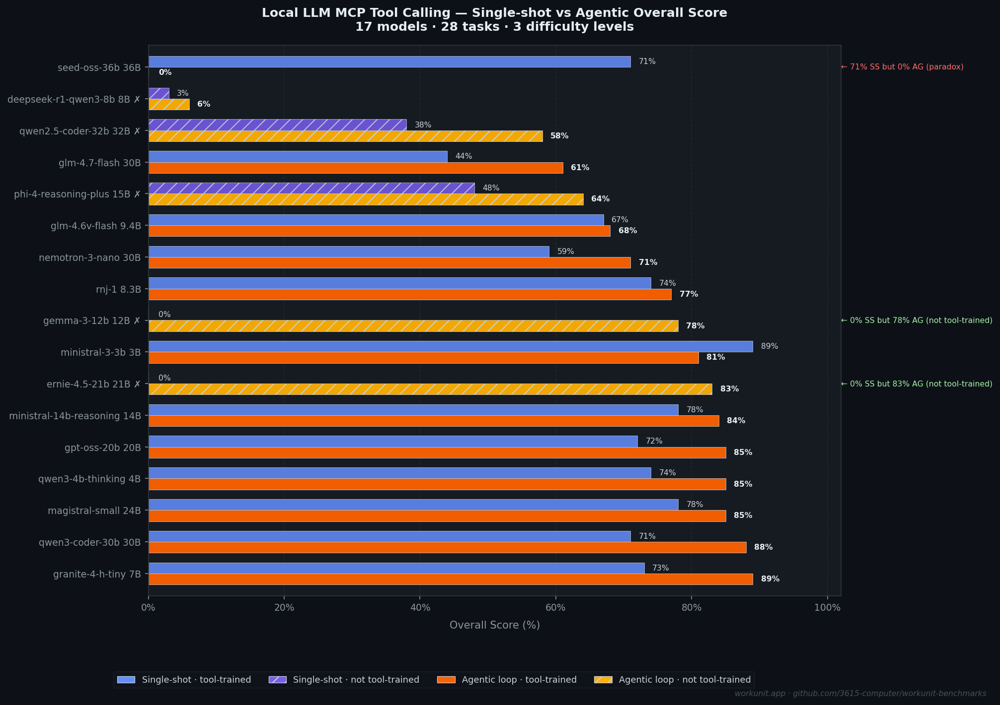
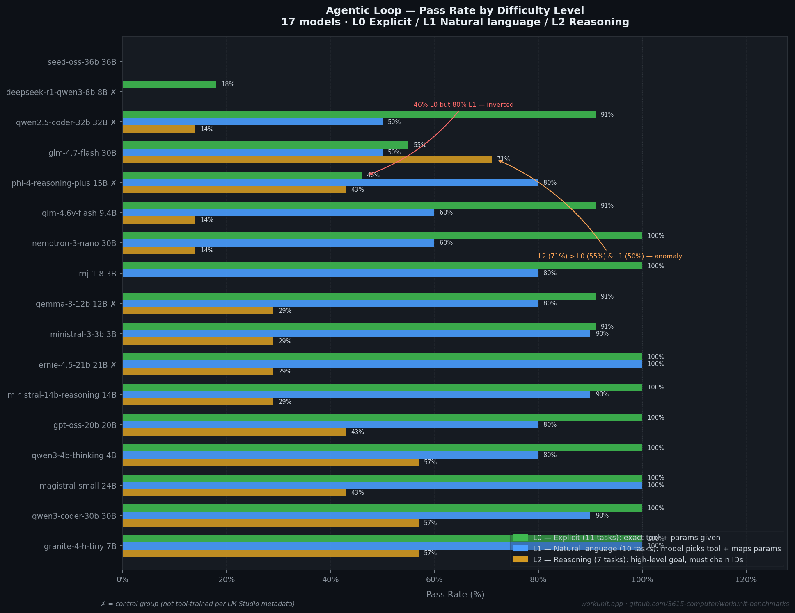
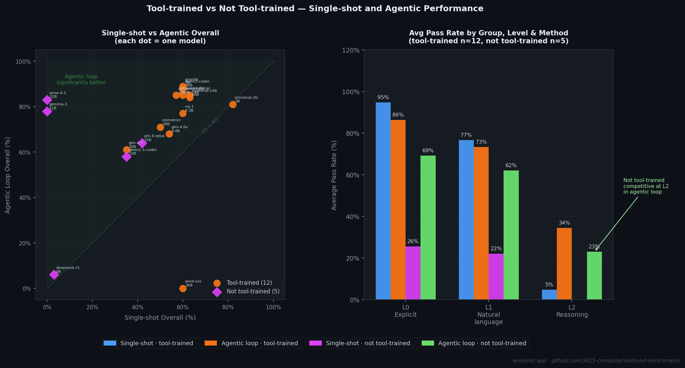

# MCP Tool Calling Performance of Local LLMs: Single-shot vs Agentic Evaluation Across 21 Models

## Abstract

This report presents benchmark results for 21 locally-run large language models (LLMs) evaluated on their ability to perform tool calling via the Model Context Protocol (MCP). Models ranging from 3B to 80B parameters were tested against a real project management API with 19 tools across 28 tasks at three difficulty levels: explicit instruction following (L0), natural language interpretation (L1), and multi-step reasoning with ID chaining (L2). Each model was evaluated under two methodologies: single-shot (one response, no feedback) and agentic loop (iterative tool calls with real API responses fed back). Results indicate that evaluation methodology significantly affects measured performance, particularly at L2, and that tool-call fine-tuning is a stronger predictor of performance than parameter count alone.

---

## 1. Introduction

Tool calling is an increasingly important capability for LLMs deployed in agentic workflows. The Model Context Protocol (MCP) provides a standardized interface for LLM-tool interaction, but there is limited empirical data on how well locally-run, quantized models perform on real MCP tool calling tasks of varying complexity.

This benchmark measures two dimensions simultaneously:
1. **Task difficulty**: from explicit tool invocation (L0) through natural language mapping (L1) to multi-step reasoning chains requiring ID propagation (L2)
2. **Evaluation methodology**: single-shot (no feedback) vs. agentic loop (real tool results returned to the model)

All 21 models were tested under identical conditions: same hardware, same quantization strategy, same context length, same temperature, and same MCP server instance.

---

## 2. Experimental Setup

### 2.1 Hardware and Runtime

| Component | Specification |
|-----------|--------------|
| GPU | NVIDIA RTX 4080 16GB |
| System RAM | 64GB |
| Model runtime | LM Studio (local, OpenAI-compatible API) |
| Context length | 8192 tokens (all models) |
| Temperature | 0.0 (all models) |
| Quantization | Q4_K_M (default); exceptions noted per model |

Models were unloaded from VRAM between runs and reloaded at a fixed 8192-token context. The test database was reset between each model run to prevent data contamination.

### 2.2 MCP Server

The target API is a project management server with 19 tools: create/get/update/delete operations for projects, workunits, tasks, assets, and directories; search; save_context; and link management. The server ran locally and processed actual API calls with persistent state within each model's run.

### 2.3 Models Tested

21 models across 6 size tiers. 16 models are classified as tool-trained; 5 are not (per LM Studio metadata).

| Model | Parameters | Quantization | Tool-trained |
|-------|-----------|-------------|-------------|
| mistralai/ministral-3-3b | 3B | Q4_K_M | Yes |
| qwen/qwen3-4b-thinking-2507 | 4B | Q4_K_M | Yes |
| ibm/granite-4-h-tiny | 7B | Q4_K_M | Yes |
| deepseek/deepseek-r1-0528-qwen3-8b | 8B | Q4_K_M | No |
| essentialai/rnj-1 | 8.3B | Q4_K_M | Yes |
| zai-org/glm-4.6v-flash | 9.4B | Q4_K_M | Yes |
| google/gemma-3-12b | 12B | Q4_K_M | No |
| mistralai/ministral-3-14b-reasoning | 14B | Q4_K_M | Yes |
| microsoft/phi-4-reasoning-plus | 15B | Q4_K_M | No |
| openai/gpt-oss-20b | 20B | MXFP4 | Yes |
| baidu/ernie-4.5-21b-a3b | 21B | Q4_K_M | No |
| mistralai/magistral-small-2509 | 24B | Q4_K_M | Yes |
| mistralai/devstral-small-2-2512 | 24B | Q3_K_L | Yes |
| liquid/lfm2-24b-a2b | 24B | Q4_K_M | Yes |
| nvidia/nemotron-3-nano | 30B | Q4_K_M | Yes |
| zai-org/glm-4.7-flash | 30B | Q4_K_M | Yes |
| qwen/qwen3-coder-30b | 30B | Q4_K_M | Yes |
| qwen/qwen2.5-coder-32b | 32B | Q4_K_M | No |
| qwen/qwen3.5-35b-a3b | 35B | Q4_K_M | Yes |
| bytedance/seed-oss-36b | 36B | Q4_K_M | Yes |
| qwen/qwen3-coder-next | 80B | Q4_K_M | Yes |

### 2.4 Task Design

28 tasks across 3 difficulty levels, targeting the 19-tool MCP API.

**Level 0 — Explicit** (11 tasks): The prompt specifies the exact tool name and all required parameters. Tests format compliance and tool call emission.

**Level 1 — Natural language** (10 tasks): The prompt describes the desired outcome in natural language. The model must identify the correct tool and map unstructured information to parameter names and values.

**Level 2 — Reasoning** (7 tasks): The prompt provides a high-level goal. The model must plan a multi-step sequence, select appropriate tools, and propagate IDs returned from earlier calls into subsequent ones.

### 2.5 Scoring

Each task defines a required sequence of tool calls with argument constraints. The runner collects all calls made during the task and validates them against the criteria.

- **Task score** (0-100%): Partial credit is awarded for completing some steps of a multi-step task.
- **Pass rate**: Binary — a task passes only at ≥75% score.
- **Level score**: Mean task score across all tasks at that level.
- **Overall score**: Mean of the three level scores.

### 2.6 Evaluation Methodologies

**Single-shot**: The model receives the system prompt, tool definitions, and user task. It produces one response (which may contain one or more tool calls). No tool results are returned. Scoring is based on the calls emitted in that single response.

**Agentic loop**: After each tool call, the runner executes the call against the live MCP server and returns the result as a `tool` role message. The model may continue calling tools until the task validation passes or a 300-second timeout is reached. The runner exits immediately upon task completion (early exit).

---

## 3. Results

### 3.1 Agentic Loop — Overall Rankings

| Rank | Model | Size | Tool-trained | L0 Pass% | L1 Pass% | L2 Pass% | Overall |
|------|-------|------|-------------|---------|---------|---------|---------|
| 1 | qwen/qwen3-coder-30b | 30B | Yes | 100% | 90% | 71% | 92% |
| 1 | qwen/qwen3-coder-next | 80B | Yes | 100% | 90% | 71% | 92% |
| 3 | baidu/ernie-4.5-21b-a3b | 21B | No | 100% | 100% | 29% | 85% |
| 3 | qwen/qwen3-4b-thinking-2507 | 4B | Yes | 100% | 80% | 57% | 85% |
| 3 | ibm/granite-4-h-tiny | 7B | Yes | 100% | 100% | 29% | 85% |
| 3 | openai/gpt-oss-20b | 20B | Yes | 100% | 80% | 43% | 85% |
| 7 | mistralai/ministral-3-14b-reasoning | 14B | Yes | 100% | 90% | 29% | 84% |
| 8 | mistralai/magistral-small-2509 | 24B | Yes | 100% | 100% | 29% | 82% |
| 8 | mistralai/devstral-small-2-2512 | 24B | Yes | 100% | 80% | 43% | 82% |
| 10 | mistralai/ministral-3-3b | 3B | Yes | 91% | 90% | 29% | 81% |
| 11 | google/gemma-3-12b | 12B | No | 91% | 80% | 43% | 80% |
| 12 | qwen/qwen3.5-35b-a3b | 35B | Yes | 100% | 50% | 71% | 77% |
| 12 | nvidia/nemotron-3-nano | 30B | Yes | 100% | 60% | 43% | 77% |
| 12 | essentialai/rnj-1 | 8.3B | Yes | 100% | 80% | 0% | 77% |
| 15 | liquid/lfm2-24b-a2b | 24B | Yes | 82% | 90% | 29% | 73% |
| 16 | zai-org/glm-4.6v-flash | 9.4B | Yes | 91% | 60% | 29% | 70% |
| 17 | zai-org/glm-4.7-flash | 30B | Yes | 55% | 60% | 71% | 63% |
| 18 | microsoft/phi-4-reasoning-plus | 15B | No | 46% | 80% | 43% | 62% |
| 19 | qwen/qwen2.5-coder-32b | 32B | No | 91% | 50% | 14% | 58% |
| 20 | deepseek/deepseek-r1-0528-qwen3-8b | 8B | No | 0% | 0% | 0% | 0% |
| 20 | bytedance/seed-oss-36b | 36B | Yes | 0% | 0% | 0% | 0% |

*Figure 1: Single-shot vs Agentic overall scores for all 21 models. Hatched bars indicate models not trained for tool calling.*

### 3.2 Agentic Loop — Level Breakdown

*Figure 2: Agentic loop pass rates at each difficulty level. Models sorted by overall score descending.*

**L0 (Explicit)**: 14 of 21 models achieve 100% pass rate. The median L0 pass rate is 100%. Two models score 0% (deepseek-r1 and seed-oss).

**L1 (Natural language)**: Performance spreads more widely. The median L1 pass rate is 80%. Common failure points: L1-03 ("add three tasks") requires emitting three sequential `create_task` calls from a single prompt — most models emit one. L1-05 ("search and retrieve") requires a two-step retrieval pattern (search, then get by ID) — most models stop after the search.

**L2 (Reasoning)**: The most discriminating level. Pass rates range from 0% to 71%. Only 4 models exceed 50% at L2: qwen3-coder-30b (71%), qwen3-coder-next (71%), qwen3.5-35b (71%), and glm-4.7-flash (71%). All tasks at L2 require multi-step planning and/or ID propagation between calls.

**L2-07 (end-of-sprint closeout)**: Requires three sequential operations with state threading — update tasks to done, save a context summary, and complete the workunit. No model achieves a full pass in either methodology, though ernie-4.5 comes closest with a 95% task score.

### 3.3 Single-shot Results

| Rank | Model | Size | Tool-trained | L0 Pass% | L1 Pass% | L2 Pass% | Overall |
|------|-------|------|-------------|---------|---------|---------|---------|
| 1 | qwen/qwen3-coder-next | 80B | Yes | 100% | 90% | 0% | 81% |
| 2 | mistralai/devstral-small-2-2512 | 24B | Yes | 100% | 90% | 0% | 79% |
| 3 | liquid/lfm2-24b-a2b | 24B | Yes | 73% | 90% | 57% | 78% |
| 3 | mistralai/ministral-3-14b-reasoning | 14B | Yes | 100% | 90% | 0% | 78% |
| 3 | mistralai/magistral-small-2509 | 24B | Yes | 100% | 90% | 0% | 78% |
| 6 | openai/gpt-oss-20b | 20B | Yes | 100% | 80% | 0% | 76% |
| 6 | mistralai/ministral-3-3b | 3B | Yes | 100% | 90% | 0% | 76% |
| 8 | essentialai/rnj-1 | 8.3B | Yes | 100% | 80% | 0% | 74% |
| 9 | qwen/qwen3-coder-30b | 30B | Yes | 100% | 80% | 0% | 73% |
| 9 | ibm/granite-4-h-tiny | 7B | Yes | 100% | 80% | 0% | 73% |
| 11 | bytedance/seed-oss-36b | 36B | Yes | 100% | 80% | 0% | 71% |
| 12 | qwen/qwen3.5-35b-a3b | 35B | Yes | 91% | 70% | 0% | 65% |
| 13 | zai-org/glm-4.6v-flash | 9.4B | Yes | 82% | 70% | 0% | 61% |
| 14 | nvidia/nemotron-3-nano | 30B | Yes | 91% | 40% | 0% | 51% |
| 15 | zai-org/glm-4.7-flash | 30B | Yes | 64% | 40% | 0% | 44% |
| 16 | qwen/qwen2.5-coder-32b | 32B | No | 64% | 40% | 0% | 38% |
| 16 | microsoft/phi-4-reasoning-plus | 15B | No | 55% | 60% | 0% | 38% |
| 18 | qwen/qwen3-4b-thinking-2507 | 4B | Yes | 91% | 20% | 0% | 37% |
| 19 | deepseek/deepseek-r1-0528-qwen3-8b | 8B | No | 9% | 0% | 0% | 3% |
| 20 | google/gemma-3-12b | 12B | No | 0% | 0% | 0% | 0% |
| 20 | baidu/ernie-4.5-21b-a3b | 21B | No | 0% | 0% | 0% | 0% |

**L2 in single-shot**: 20 of 21 models score 0% pass rate at L2. The one exception is liquid/lfm2-24b (57% pass rate). Tasks requiring ID chaining (passing the `id` returned by one tool call as a parameter to the next) are structurally impossible in single-shot since intermediate results are not observed by the model.

### 3.4 Tool-trained vs Not Tool-trained

*Figure 3: Left panel — scatter plot of single-shot vs agentic overall scores. Right panel — average pass rates by group, level, and methodology.*

**5 models not trained for tool calling** (per LM Studio metadata): ernie-4.5-21b, gemma-3-12b, phi-4-reasoning-plus, qwen2.5-coder-32b, deepseek-r1-0528-qwen3-8b.

Key observations:

- In single-shot, the average L0 pass rate for not-tool-trained models is 26% vs. 93% for tool-trained models. Two not-tool-trained models (ernie-4.5 and gemma-3) scored 0% across all levels in single-shot — they never emitted tool calls.
- In the agentic loop, the gap narrows at L0 (66% not-tool-trained vs. 88% tool-trained) and L1 (62% vs. 75%). At L2, not-tool-trained models average 26% vs. 35% for tool-trained.
- Two not-tool-trained models that scored 0% in single-shot (ernie-4.5, gemma-3) achieved 85% and 80% in the agentic loop, indicating that the agentic context provides sufficient signal for capable models to infer tool call format.
- deepseek-r1-0528-qwen3-8b never successfully called any tool in either methodology. Its responses contained syntactically correct tool call structures but with hallucinated tool names (e.g., `tool_name` as a literal string).

### 3.5 Methodology Impact — SS vs AG Delta

The mean absolute delta between single-shot and agentic overall scores across all 21 models is 18.3 percentage points. The direction is not uniform:

- **17 models improved** with the agentic loop (mean gain: +22.4 pp)
- **2 models showed minimal change** (deepseek-r1: both near 0%)
- **2 models scored lower in agentic**: seed-oss-36b dropped from 71% to 0%, lfm2-24b dropped from 78% to 73%

The seed-oss result is a notable anomaly: the model performed well in single-shot (100% L0, 80% L1) but emitted zero tool calls in the agentic loop. The only difference between methodologies is that the agentic runner feeds tool results back as context, which appears to suppress tool calling for this model.

---

## 4. Analysis

### 4.1 Parameter Count vs Performance

There is no consistent positive correlation between parameter count and agentic overall score. A 7B model (granite-4-h-tiny) ties for 3rd place at 85%, outperforming several models in the 20-36B range. The 4B model (qwen3-4b-thinking) also scores 85%. Conversely, a 32B model (qwen2.5-coder) scores 58%. Tool-call fine-tuning and architecture appear to be stronger predictors than parameter count for this benchmark.

### 4.2 Inverted Difficulty Curves

Two models exhibit non-monotonic performance across difficulty levels in the agentic loop:

- **phi-4-reasoning-plus**: 46% L0, 80% L1, 43% L2. The model performs worse on explicit instructions than on natural language prompts. This may indicate training distribution bias toward conversational rather than structured instruction formats.
- **glm-4.7-flash**: 55% L0, 60% L1, 71% L2. The model scores highest on reasoning tasks while underperforming on explicit tool calls. It passes 5 of 7 L2 tasks while failing basic L0 format compliance tasks.

### 4.3 Common Failure Patterns

The following patterns account for the majority of task failures across models:

1. **`update_mask` omission or flattening**: Tasks requiring an `update_mask: { paths: [...] }` nested object. Most models either omit the field entirely or pass paths as flat arguments.
2. **Single-call truncation**: Tasks requiring multiple calls from a single prompt (e.g., "add three tasks"). Most models emit one call and stop.
3. **Missing follow-up retrieval**: Two-step patterns (search → get by ID). Models perform the search but skip the subsequent `get` call.
4. **ID chaining failure**: Passing IDs returned from one tool call as parameters to the next. This requires observing intermediate results, making it structurally impossible in single-shot and challenging even in the agentic loop.

### 4.4 Reproducibility

Each model was tested in a single run. To assess result stability, a subset of models was retested in a second run under identical conditions:

- **Single-shot** (17 models, two runs): 10 of 17 models (59%) produced identical scores. The remaining 7 showed variation, concentrated in reasoning/thinking models (e.g., qwen3-4b-thinking dropped from 74% to 37% due to nondeterministic empty responses despite temperature=0.0).
- **Agentic loop** (17 models, two runs): Mean absolute delta of 2 percentage points. 67% of models produced identical scores. Maximum observed delta was 6 percentage points.

Agentic results showed higher reproducibility than single-shot results, likely because the feedback loop provides self-correction opportunities that reduce sensitivity to initial response variation.

Results should be treated as point estimates. Models with higher variance (particularly reasoning/thinking models at temperature=0.0) may produce different scores across runs.

---

## 5. Limitations

1. **Single hardware configuration**: All results obtained on one RTX 4080 16GB system. Different GPUs, drivers, or memory configurations may produce different inference behavior.
2. **Fixed context length**: 8192 tokens for all models. Models designed for longer contexts may underperform at this limit. The limit was chosen to fit all models in 16GB VRAM.
3. **Quantization effects**: All models run at Q4_K_M (two exceptions: gpt-oss at MXFP4, devstral at Q3_K_L). Higher-fidelity quantizations may yield different results.
4. **Single API schema**: Tasks target one specific project management API. Results may not generalize to other MCP servers with different tool schemas.
5. **LM Studio metadata**: The "tool-trained" classification relies on LM Studio's metadata, not independent verification of each model's training data.
6. **Limited run count**: Single primary run per model per methodology. Statistical confidence intervals cannot be computed from a single observation.
7. **Temperature 0.0 nondeterminism**: Despite temperature=0.0, some models exhibited nondeterministic behavior across runs, attributed to floating-point accumulation differences in quantized inference.

---

## 6. Methodology Details

### 6.1 Runner Implementation

Both runners are implemented in Python using the `openai` client library for model interaction and streamable HTTP for MCP server communication. The agentic runner implements:

- Automatic model loading/unloading via LM Studio management API
- Database reset between model runs
- Per-task 300-second timeout
- Early exit on task validation pass
- Full tool call logging and result capture

### 6.2 Validation

Each task defines validation criteria as a sequence of expected tool calls with argument constraints. Validation types include:

- `tool_call_match`: Exact tool name and required parameters
- `multi_tool_call`: Multiple calls of the same tool required
- `multi_tool_sequence`: Ordered sequence of different tool calls
- `reasoning_chain`: Multi-step sequence with ID propagation between calls
- `param_contains`: Substring matching for flexible parameter validation

A task's score is the percentage of validation steps passed. A task "passes" at ≥75% score.

### 6.3 Scoring Formula

For each model:
- **Level score** = mean of all task scores at that level
- **Overall score** = mean of the three level scores (L0, L1, L2)

This gives equal weight to each difficulty level regardless of task count (11, 10, 7 tasks respectively).

---

## 7. Data Availability

All code, task definitions, and raw results are available at:
https://github.com/3615-computer/workunit-benchmarks

- Task definitions: `local-llm-mcp-calling/tasks/*.json`
- Single-shot results: `local-llm-mcp-calling/results/v1_singleshot/*.json`
- Agentic results: `local-llm-mcp-calling/results/v2_agentic/*.json`
- Aggregated reports: `local-llm-mcp-calling/results/*/aggregated_report.md`
- Graph generation scripts: `local-llm-mcp-calling/reports/images/gen_graph*.py`

---

*Generated from benchmark data collected February 22-25, 2026.*
